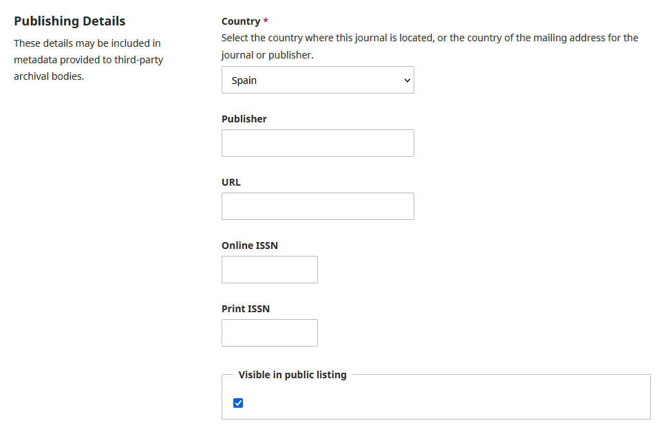

# Hide Journal Plugin

This plugin allows you to Hide a Journal in OJS in the indexSite while keeping it active

## Instructions

### Plugin Installation Guide for OJS

You can install this plugin in two ways:

#### 1. Upload via the OJS Web Interface

-   Go to the Dashboard > Website Settings > Plugins.
-   Click on Upload a New Plugin.
-   Select the plugin .tar.gz or .zip archive and upload it.
-   Once installed, make sure to enable the plugin.

#### 2. Manual Installation

-   Upload or extract the plugin folder into the appropriate directory:
    -   ojs/plugins/generic
    -   Activate plugin from plugin from "Website -> Plugins"

### Plugin Usage

-   The plugin adds a checkbox to the Masthead -> Publishing Details - settings of the journal in which it is enabled
    -   

### To be considered

-   This plugin acts specifically to the indexSite.tpl template that ojs defaults to, if you are using a custom theme it may not work as expected (line 85).
